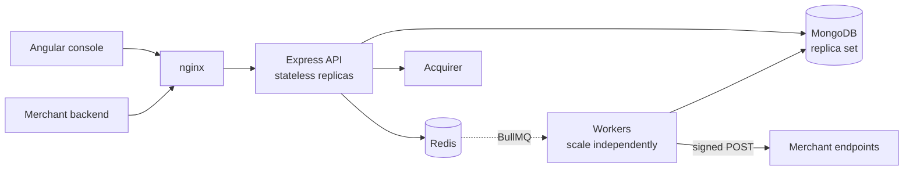

# PayFlux — Distributed Payment Gateway

A production-grade payment orchestration platform: idempotent payment APIs, a double-entry
transaction ledger, an asynchronous settlement pipeline, rule-based fraud detection, and a
real-time operations console.

Built to demonstrate the concerns a payment system actually has to solve — duplicate charges under
retry, over-refunding under concurrency, at-least-once queue delivery, partial upstream failure, and
provable financial correctness — rather than CRUD over a `payments` table.

**Node.js · Express · MongoDB · Redis · BullMQ · Angular 17 · Docker**

> ### New here?
> - **What is this and who uses it?** → [`docs/what-is-payflux.md`](./docs/what-is-payflux.md)
>   (plain English, no payments knowledge assumed)
> - **I want to integrate it into my app** → [`docs/integration-guide.md`](./docs/integration-guide.md)
> - **I want to use the dashboard** → [`docs/console-guide.md`](./docs/console-guide.md)
>
> **Can it take real money today? No.** Everything works except the final leg to the actual card
> networks, which is a simulator. See
> [what-is-payflux.md §6](./docs/what-is-payflux.md#6-can-i-use-this-to-take-real-money-today) for
> exactly what would be required.

---

## Table of contents

- [Quick start](#quick-start)
- [What it does](#what-it-does)
- [What this actually demonstrates](#what-this-actually-demonstrates)
- [Verified behaviour](#verified-behaviour)
- [Architecture](#architecture)
- [Project structure](#project-structure)
- [API](#api)
- [Testing](#testing)
- [Documentation](#documentation)
- [Known limitations](#known-limitations)

---

## Quick start

**One click.** Clone the repo, then:

| Platform | What to do |
|---|---|
| **Windows** | Double-click **`RUN-PAYFLUX.bat`** |
| **macOS / Linux** | `./run-payflux.sh` |

That's it. The script checks Docker is actually running, generates the JWT
secrets, finds free ports if the defaults are taken, builds and starts all six
containers, waits for the API to report healthy, seeds 420 demo payments, and
opens your browser.

<details>
<summary>Or do it manually</summary>

```bash
git clone https://github.com/MOHITU778/payflux.git && cd payflux

# Both secrets must be 32+ characters or the API refuses to boot.
cp .env.example .env
sed -i "s|^JWT_SECRET=.*|JWT_SECRET=$(openssl rand -hex 32)|" .env
sed -i "s|^JWT_REFRESH_SECRET=.*|JWT_REFRESH_SECRET=$(openssl rand -hex 32)|" .env

docker compose up -d --build
docker compose exec api npm run seed        # 420 demo payments + a balanced ledger
```
</details>

**Requires** [Docker Desktop](https://www.docker.com/products/docker-desktop).
Nothing else — no Node, no MongoDB, no Redis installed locally.

| Service | URL |
|---|---|
| **Demo storefront** (buy something) | http://localhost:8081 |
| Operations console (admin) | http://localhost:8080 |
| API | http://localhost:4000/api/v1 |
| Swagger UI | http://localhost:4000/api/docs |
| Health | http://localhost:4000/health |
| Prometheus metrics | http://localhost:4000/metrics |

> **Port already in use?** Override any of them in `.env` — `API_PORT`,
> `CONSOLE_PORT`, `MONGO_PORT`, `REDIS_PORT_HOST` — then `docker compose up -d`
> again. The URLs above shift accordingly.

**Demo accounts** (password `PayFlux#2024` for all):

| Role | Email | Sees |
|---|---|---|
| ADMIN | `admin@payflux.io` | Everything, including the ledger and settlement triggers |
| MERCHANT | `merchant@nimbusretail.example` | Only their own merchant's data |
| SUPPORT | `support@payflux.io` | Read-only across the platform |

> If any of `4000`, `8080`, `27017` or `6379` is already taken on your machine, override it in
> `.env` — `API_PORT`, `CONSOLE_PORT`, `MONGO_PORT`, `REDIS_PORT_HOST`.

### Running without Docker

```bash
# MongoDB must be a replica set — the ledger uses multi-document transactions.
docker run -d -p 27017:27017 --name pf-mongo mongo:7 --replSet rs0 --bind_ip_all
docker exec pf-mongo mongosh --eval 'rs.initiate()'
docker run -d -p 6379:6379 --name pf-redis redis:7-alpine

cd backend && npm install && cp .env.example .env
npm run seed
npm run dev        # API + schedulers on :4000
npm run worker:dev # queue consumers (separate terminal)

cd ../frontend && npm install && npm start   # console on :4200, proxying to :4000
```

---

## What it does

A payment gateway is the layer between "customer clicked Pay" and "money reached the merchant's bank
account". Taking the money is the easy part; the gateway owns everything that can go wrong
afterwards. PayFlux handles all of it:

| | |
|---|---|
| **Takes payments** | One API call. Fraud-scored, sent to the card network, definitive answer returned. |
| **Never double-charges** | Idempotency keys. 12 simultaneous identical requests → exactly one charge. |
| **Refunds** | Full or partial, with three independent layers preventing over-refunding. |
| **Keeps books that balance** | Double-entry ledger with automated reconciliation. |
| **Detects fraud** | 12 weighted rules → a 0–100 risk score → allow / review / block. |
| **Notifies merchants** | Signed webhooks with a published retry ladder and a replayable dead-letter queue. |
| **Pays merchants out** | Batched settlements: gross − refunds − fees. |
| **Shows operators everything** | Live dashboard: revenue, success rate, fraud alerts, settlement queue, ledger. |

### Two user interfaces, deliberately

| | Port | Who it's for |
|---|---|---|
| **Storefront** | 8081 | A *customer* buying something. This is where payments are created. |
| **Console** | 8080 | *Operators* — dashboards, refunds, fraud review, settlements, the ledger. |

They are separate because they serve opposite audiences, and because the
storefront demonstrates the correct integration shape: the browser talks to the
**shop's own server**, which holds the API credentials and calls PayFlux. A
checkout page calling the gateway directly would put merchant credentials in
front-end JavaScript, where any customer could read them and mint payments or
issue refunds.

```
browser  →  shop server (credentials live here)  →  PayFlux API
```

The shop server also prices the order from its own catalogue rather than
trusting the browser — verified: a request claiming a ₹12,999 keyboard costs
₹1 is charged the real ₹12,999.

**Three kinds of user:**

- A merchant's **developer** calls the API → [integration guide](./docs/integration-guide.md)
- A merchant's **ops team** uses the dashboard, scoped to their own data
- **Platform staff** (ADMIN / SUPPORT) use the dashboard with wider visibility →
  [console guide](./docs/console-guide.md)

Full explanation with diagrams: [`docs/what-is-payflux.md`](./docs/what-is-payflux.md).

---

## What this actually demonstrates

### Idempotent payment processing

Every mutating payment endpoint requires an `Idempotency-Key`. Four independent layers prevent a
duplicate charge:

| Layer | Mechanism | Catches |
|---|---|---|
| 1 | Redis `SET NX` claim | The common case — a client retry after a timeout |
| 2 | Mongo unique index on `(merchant, endpoint, key)` | A Redis eviction or `FLUSHALL` |
| 3 | Distributed lock on `payment:<id>` | Two API replicas acting concurrently |
| 4 | CAS status transition | A *lost lock* — Redis failover, or a GC pause outliving the TTL |

Layer 4 is what actually guarantees correctness. Layers 1–3 exist so the common case returns a clean
answer instead of a lost race. **A Redis lock is an optimisation, not a mutex** — that assumption is
stated explicitly rather than assumed away.

### Double-entry ledger

Money is never a single mutable `balance` column. Every movement posts a balanced journal:

```
₹1,000.00 capture at a 2% fee
  DEBIT   gateway_clearing          100000    asset ↑     we now hold the money
  CREDIT  merchant_payable:mrch_x    98000    liability ↑ we owe the merchant
  CREDIT  platform_revenue            2000    revenue ↑   our fee
  ─────────────────────────────────────────
          debits 100000 = credits 100000  ✓
```

Entries are **immutable** — corrections post a reversing journal, never an edit. Reconciliation
recomputes every balance from the entry stream and **reports** drift rather than silently repairing
it, because auto-correcting money is how a bug becomes a cover-up.

### Asynchronous pipeline

Only two things happen inside the payment request: take the money, record it. Ledger posting,
webhook fan-out, invoices, notifications and settlement are queued — doing them inline would add
hundreds of milliseconds to checkout and couple a customer's success to the health of an email
provider.

BullMQ is at-least-once. **"Exactly once" is not something a queue can give you; idempotent
consumers are** — so every consumer is idempotent by construction (deterministic journal keys,
unique `(eventId, endpoint)` indexes, CAS transitions).

### Resilience

Circuit breaker with a real half-open state; exponential backoff with full jitter; a published
webhook retry ladder (10s → 6h) and a dead-letter queue that is an **inbox, not a graveyard**;
graceful shutdown that drains in-flight payments; readiness and liveness probes deliberately kept
separate so a database blip does not restart every replica at once.

---

## Verified behaviour

Not aspirational — these were run against the live stack:

```
Idempotency
  12 concurrent requests, one key   → 1 × 201, 11 × 409, ONE row in the database
  retry with identical body         → replayed response, x-idempotent-replay: true
  same key, different body          → 422 IDEMPOTENCY_KEY_REUSE

Refunds
  6 concurrent ₹300 refunds vs ₹1,000 → at most 3 accepted
                                        amountRefunded ≤ amountMinor always holds

Ledger (453 entries, live database)
  total debits 112,137,284 = total credits 112,137,284      balanced ✓
  assets = liabilities + revenue − expenses                 identity holds ✓
  reconciliation                                            0 discrepancies ✓
  injected balance drift                                    detected and reported, not repaired ✓

Fraud engine
  sanctioned jurisdiction           → blocked at score 100, before the acquirer is called
  card-testing burst                → escalated to a block at attempt 5

Webhooks
  HMAC verified against the raw body by an independent receiver ✓
  tampered body                     → signature mismatch ✓
  replayed signature + fresh timestamp → rejected ✓

Distributed lock
  expired holder calling release    → cannot delete the new holder's lock ✓

Tests: 124 passed (70 unit, 54 integration against real MongoDB + Redis)
```

---

## Architecture



The API and workers are **separate processes** so a runaway job consumes worker CPU, never the CPU
serving live payments — and because webhook dispatch (I/O-bound, concurrency 25) and ledger posting
(write-contended, concurrency 4) want completely different tuning.

Full detail in [`docs/architecture.md`](./docs/architecture.md).

---

## Project structure

```
payflux/
├── backend/
│   ├── src/
│   │   ├── config/          env validation, logger, mongo, redis, metrics, swagger
│   │   ├── constants/       every domain enum + the state-machine transition table
│   │   ├── controllers/     HTTP ⇄ service translation only
│   │   ├── errors/          typed error taxonomy (status, code, retryable)
│   │   ├── jobs/            cron schedulers, lock-guarded for leader election
│   │   ├── middlewares/     context, security, auth/RBAC, validation, idempotency, errors
│   │   ├── models/          16 Mongoose schemas with their index strategy
│   │   ├── queues/          BullMQ topology + typed producers
│   │   ├── repositories/    all data access; nothing above this imports a model
│   │   ├── routes/v1/       route table and middleware composition
│   │   ├── services/        all business logic, framework-free
│   │   ├── utils/           money, ids, crypto, backoff, pagination, request context
│   │   ├── validators/      Joi DTOs
│   │   └── workers/         queue consumers + the worker process entry point
│   ├── tests/               unit (no infra) + integration (real Mongo/Redis)
│   └── scripts/seed.js
├── frontend/                Angular 17 admin console — standalone, signals, lazy routes
├── storefront/              Demo merchant shop — the buyer's side of a payment
├── docs/                    architecture, schema, API, Redis, queues, webhooks, LLD, diagrams
├── RUN-PAYFLUX.bat          one-click start for Windows
├── run-payflux.sh           one-command start for macOS / Linux
├── scripts/launch.ps1       the launcher logic both scripts share
└── docker-compose.yml
```

**Dependency rule:** `routes → controllers → services → repositories → models`, one direction only.
A service never imports a controller; a repository never imports a service. That is what makes the
services testable against a fake repository.

---

## API

Base `/api/v1`. Interactive docs at `/api/docs`.

```bash
# Sign in
TOKEN=$(curl -s -X POST localhost:4000/api/v1/auth/login \
  -H 'content-type: application/json' \
  -d '{"email":"merchant@nimbusretail.example","password":"PayFlux#2024"}' \
  | jq -r .data.accessToken)

# Create a payment — amounts are integer MINOR units (150000 = ₹1,500.00)
curl -X POST localhost:4000/api/v1/payments \
  -H "authorization: Bearer $TOKEN" \
  -H 'content-type: application/json' \
  -H "idempotency-key: $(uuidgen)" \
  -d '{"amountMinor":150000,"currency":"INR","method":"CARD",
       "customer":{"email":"buyer@example.com","country":"IN"}}'

# Send it again with the SAME key → the stored response, not a second charge
```

Every response carries a `correlationId`, echoed in `x-correlation-id`. Quote it and the whole
request is recoverable from the logs, across the API and all five workers.

Full endpoint list, error codes and the idempotency contract:
[`docs/api-design.md`](./docs/api-design.md).

---

## Testing

```bash
cd backend
npm run test:unit          # 70 tests, no infrastructure needed
npm test                   # 124 tests — integration needs Mongo + Redis
npm run test:coverage
```

Unit tests are pure: money arithmetic, the state machine, the circuit breaker, HMAC signing, and the
fraud rules (which are pure functions of a signal snapshot, so they need no database).

Integration tests run against **real** MongoDB and Redis, because the properties under test —
unique-index races, `$expr` conditional updates, Lua lock scripts, TTLs — are behaviours of those
datastores. A mock that reimplements them proves only that the mock works. They skip cleanly with a
clear message when infrastructure is absent.

---

## Documentation

**Start here — written for people using PayFlux:**

| Document | Contents |
|---|---|
| [what-is-payflux.md](./docs/what-is-payflux.md) | What a payment gateway is, what this one does, who uses it, and honestly what it cannot do |
| [integration-guide.md](./docs/integration-guide.md) | Step-by-step merchant integration with real captured responses, a reference client, and a go-live checklist |
| [console-guide.md](./docs/console-guide.md) | Every dashboard screen, what each number means, and the daily operational routine |

**Engineering internals:**

| Document | Contents |
|---|---|
| [architecture.md](./docs/architecture.md) | System diagram, request pipeline, layering, failure modes, security posture |
| [database-schema.md](./docs/database-schema.md) | 16 collections, ER diagram, index strategy and the reasoning behind each |
| [api-design.md](./docs/api-design.md) | Endpoints, response envelope, error codes, the idempotency contract |
| [redis-architecture.md](./docs/redis-architecture.md) | Five roles, keyspace, TTLs, Lua scripts, failure behaviour |
| [queue-architecture.md](./docs/queue-architecture.md) | Seven queues, retry policies, at-least-once semantics, the DLQ |
| [webhook-flow.md](./docs/webhook-flow.md) | Outbound outbox and retries, inbound verification, a merchant-side verification snippet |
| [sequence-diagrams.md](./docs/sequence-diagrams.md) | Six annotated flows including the concurrent-retry and over-refund races |
| [low-level-design.md](./docs/low-level-design.md) | The non-obvious implementation decisions and the bugs they prevent |

---

## Known limitations

Stated plainly, because a design document claiming no weaknesses is not credible.

1. **The Redis lock is not a perfect mutex.** Under a primary failover with unreplicated writes, or
   a GC pause exceeding the TTL, two holders are possible. Every critical section it guards is also
   protected by a database invariant, so a lost lock degrades to a rejected write, never a double
   charge.
2. **The acquirer is simulated.** The *boundary* is real — circuit breaker, timeouts, structured
   declines distinguished from retryable failures — but the implementation is a deterministic stub.
   Swapping it means replacing one method body.
3. **Console tokens live in `localStorage`** and are therefore XSS-exposed. An httpOnly
   `SameSite=Strict` cookie is the correct production choice; the 15-minute token lifetime and
   server-side `tokenVersion` revocation bound the damage.
4. **The transaction feed is an eventually-consistent projection.** It is a read convenience, never
   the source of truth for money — the ledger is.
5. **Multi-currency is modelled but not exercised.** Accounts are per `(code, currency)` and a
   journal never mixes currencies, but there is no FX conversion or rate handling.
6. **No distributed tracing backend.** Correlation IDs propagate end-to-end, but there is no
   OpenTelemetry exporter — the next thing worth adding.

---

## License

MIT
