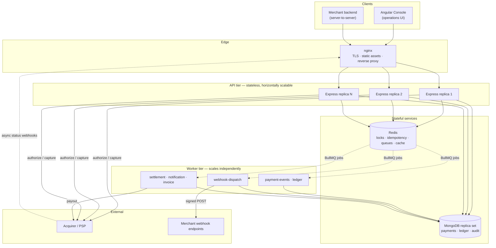
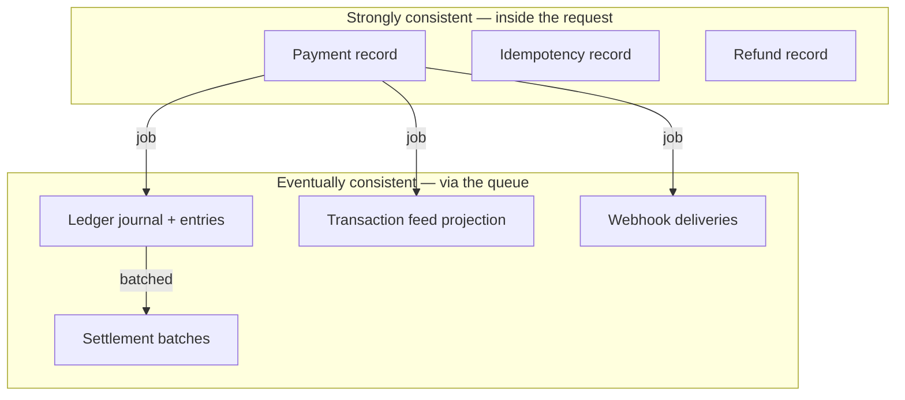

# PayFlux — System Architecture

## 1. High-level architecture



### Why the tiers are split

| Concern | Decision | Reason |
|---|---|---|
| API vs worker | Separate processes and containers | A slow PDF render or a webhook to a black-holing endpoint consumes worker CPU, never the CPU serving live payments. They also scale on different signals: webhook dispatch is I/O-bound and wants concurrency 25; ledger posting is write-bound and wants 4. |
| State | Entirely in Mongo and Redis | API replicas hold no session or in-flight state, so any replica can serve any request and a pod can be killed at any moment. |
| Schedulers | Run only in the API process, guarded by a distributed lock | Every replica ticks; exactly one wins the lock and executes. Poor-man's leader election, which is the right amount of machinery for periodic maintenance. |

---

## 2. Request pipeline

The middleware order in `src/app.js` **is** the security model. Each position is deliberate:


Ordering rationale:

- **Correlation ID first** — everything downstream logs it, including the error handler.
- **Rate limit before auth** — an unauthenticated flood is rejected before it costs a database round trip.
- **Scope before validate** — the tenant filter must exist before any handler can read data, so a missed check fails *closed*.
- **Idempotency last** — the claim is only taken for a request that already passed auth and validation. Otherwise a malformed request would burn its own key and the client could never retry it correctly.
- **Release on 5xx** — an unexpected failure frees the key so the client's retry actually executes, rather than replaying a stored failure for 24 hours.

---

## 3. Layered backend design

```
routes/      HTTP verbs, paths, middleware composition. No logic.
controllers/ Translate HTTP ⇄ service calls. No business rules.
services/    All business logic. Framework-free, so a queue worker or a CLI
             can drive them without dragging Express along.
repositories/Data access. Nothing above this layer imports a Mongoose model,
             builds a query, or knows what a session is.
models/      Schemas, indexes, and schema-level invariants.
```

The dependency rule is one-directional: `routes → controllers → services → repositories → models`. A service never imports a controller; a repository never imports a service. That is what makes the services unit-testable against a fake repository.

### Dependency injection

Services accept their collaborators through the constructor and fall back to the singleton:

```js
class PaymentService {
  constructor(deps = {}) {
    this.payments = deps.paymentRepository ?? paymentRepository;
    this.fraud    = deps.fraudService      ?? fraudService;
    this.acquirer = deps.acquirer          ?? acquirer;
  }
}
```

Production gets the wired singleton for free; a test constructs `new PaymentService({ acquirer: fakeAcquirer })` with no container, no decorators and no `jest.mock` of the module registry. The fraud unit tests use exactly this to score without a database.

---

## 4. Correctness model — the layered defences

The system assumes every component can fail and every message can be delivered twice. Correctness therefore never rests on a single mechanism.

### Duplicate charge prevention

| Layer | Mechanism | What it catches |
|---|---|---|
| 1 | `Idempotency-Key` + Redis `SET NX` | The common case: a client retry after a timeout. |
| 2 | Unique index on `(merchant, endpoint, key)` in Mongo | A Redis eviction or flush. Redis is a cache; this is the guarantee. |
| 3 | Distributed lock on `payment:<id>` | Two replicas acting on the same payment concurrently. |
| 4 | CAS status transition (`findOneAndUpdate` filtered on expected status) | A lost lock — under a Redis failover or a GC pause exceeding the TTL. |

Layer 4 is the one that *actually* guarantees correctness. Layers 1–3 exist so the common case returns a clean answer instead of a lost race.

### Over-refund prevention

| Layer | Mechanism |
|---|---|
| 1 | Distributed lock serialises refunds per payment |
| 2 | Eligibility counts *committed* refunds, including PENDING and PROCESSING — an in-flight refund reserves its amount |
| 3 | Conditional `$expr` update: the database itself refuses a write that would push `amountRefundedMinor` past `amountMinor` |

Verified under test: six concurrent ₹300 refunds against a ₹1,000 payment → at most three succeed, and `amountRefundedMinor ≤ amountMinor` always holds.

### Double-posting prevention (ledger)

Every journal carries a deterministic key — `payment.capture:<paymentId>` — behind a unique index. A redelivered BullMQ job returns the original journal instead of posting a second one. This is what makes at-least-once delivery safe for money.

---

## 5. Data consistency strategy



**What is synchronous:** taking the money and recording that we took it. Nothing else.

**What is asynchronous:** ledger posting, the transaction feed, webhook fan-out, invoices, notifications, settlement. Doing these inline would add hundreds of milliseconds to checkout and couple a customer's success to the health of an email provider.

**How the gap is closed:** the retry scheduler re-drives any payment left in `PROCESSING`, and reconciliation detects any payment that never received its ledger journal. Eventual consistency is only acceptable because there is a process that notices when "eventually" does not arrive.

---

## 6. Failure modes and responses

| Failure | Detection | Response |
|---|---|---|
| Acquirer unreachable mid-authorisation | Timeout / 5xx | Payment stays `PROCESSING`. **Never** marked failed — the charge may have succeeded upstream, and declaring it failed would strand real money. The reconciliation sweeper re-drives it every 5 minutes. |
| Acquirer degraded | 5 consecutive transport failures | Circuit opens; requests fail fast for 30s rather than exhausting our connection pool. Half-open probes reopen it gradually. |
| Redis down | Command errors | Idempotency falls back to the Mongo unique index. Rate limiting fails **open** (a cache outage must not lock out every merchant). Cache reads return null and fall through. |
| Mongo primary failover | Driver reconnect | Readiness probe fails → the replica leaves the load balancer but is **not** restarted (liveness deliberately touches no dependency). |
| Worker killed mid-job | BullMQ stall detection (30s) | Job is re-queued. Safe because every consumer is idempotent. |
| Merchant endpoint down | HTTP 5xx / timeout | Retry ladder 10s → 1m → 5m → 30m → 2h → 6h, then dead-letter. After N consecutive failures the endpoint auto-disables so a dead URL stops consuming dispatcher capacity. |
| Merchant endpoint returns 400 | HTTP 4xx (except 429) | Dead-lettered **immediately**. Retrying an unchanged payload against a 400 forever wastes capacity and hides a real integration bug. |
| Pod receives SIGTERM | Signal handler | Stop accepting connections → drain in-flight requests → stop schedulers → close queues → close datastores. A payment killed mid-authorisation is exactly the ambiguity the whole system exists to avoid. |

---

## 7. Scalability

| Dimension | Approach |
|---|---|
| API throughput | Stateless replicas behind a load balancer. Add pods. |
| Queue throughput | `docker compose up --scale worker=N`. BullMQ distributes across consumers. |
| Read load | Compound indexes matching the exact access patterns (ESR: Equality, Sort, Range); `$facet` collapses six dashboard tiles into one query; a 30s analytics cache with single-flight collapses N concurrent viewers into one database read. |
| Write contention | Ledger worker concurrency deliberately capped at 4 — account documents are the contention point, and more parallelism buys write conflicts, not throughput. |
| Hot keys | `CacheService.wrap` takes a short `SET NX` lock on a miss so one caller loads and the rest poll, preventing a cache stampede from saturating Mongo. |
| Metric cardinality | Prometheus labels are bounded enums and route *templates*, never payment ids. Labelling by id would mint one time series per payment and take the metrics backend down. |

---

## 8. Observability

- **Correlation IDs** propagate through `AsyncLocalStorage`, so a repository three layers deep logs the id without any function signature carrying a `ctx` parameter — and it survives `await` boundaries. Queue producers copy the id into the job payload, so a webhook retry six hours later logs the same id as the original HTTP request.
- **Structured JSON logs** with automatic redaction of `password`, `token`, `signature`, `cardNumber`, and friends.
- **Prometheus metrics**: request latency histograms, payment outcomes, lock wait time, queue depth by state, circuit state, webhook delivery outcomes, and a counter for rejected unbalanced journals.
- **Health endpoints** split into liveness (no dependencies — a failure restarts the pod) and readiness (dependency checks — a failure only removes it from rotation). Conflating them means a database blip restarts every replica simultaneously.

---

## 9. Security posture

| Control | Implementation |
|---|---|
| Authentication | JWT, 15-minute access tokens, 7-day rotating refresh tokens |
| Revocation | `tokenVersion` on the user; bumping it invalidates every issued token without a blacklist that grows forever |
| Authorization | RBAC (`ADMIN`, `MERCHANT`, `SUPPORT`) plus a tenant filter computed once in middleware and applied at the repository |
| Password storage | scrypt (memory-hard, no native build dependency), cost embedded in the hash so it can be raised later |
| Enumeration resistance | Identical response for "wrong password" and "unknown user"; the unknown-user path still performs a hash comparison so it is not measurably faster |
| Brute force | Account lockout after 5 failures via an atomic pipeline update; auth rate limit keyed by IP + email, counting only failures |
| Injection | Recursive stripping of `$`-prefixed and dotted keys from body, query and params |
| Mass assignment | Joi `stripUnknown` — a client cannot smuggle `status: 'SUCCESS'` or `feeMinor: 0` into a create-payment body |
| Webhook authenticity | HMAC-SHA256 over `${timestamp}.${rawBody}`, verified in constant time, with a 5-minute replay window |
| Transport | HSTS, CSP, `frameAncestors: none`, no `X-Powered-By` |
| Secrets | API secrets and webhook secrets stored hashed / `select: false`; returned exactly once on creation |
| PCI scope | Full PANs never enter the system. Only `last4` and the network are persisted. |

---

## 10. Deliberate limitations

Stated plainly, because an architecture document that claims no weaknesses is not credible:

1. **The Redis lock is not a perfect mutex.** Under a primary failover with unreplicated writes, or a GC pause exceeding the TTL, two holders are possible. This is why every critical section it guards is *also* protected by a database invariant. True Redlock across five independent Redis masters would reduce but not eliminate this; the CAS layer is the actual guarantee.
2. **The acquirer is simulated.** The boundary is real — circuit breaker, timeouts, structured declines vs retryable failures — but the implementation is a deterministic stub. Swapping it means replacing the body of `AcquirerService.send`, and nothing else.
3. **Console tokens live in `localStorage`**, readable by any script on the origin and therefore XSS-exposed. An httpOnly `SameSite=Strict` cookie is the correct production choice; the short token lifetime and server-side revocation bound the damage.
4. **The transaction feed is a projection**, eventually consistent with the payment record. It is a read convenience, never the source of truth for money — the ledger is.
5. **Multi-currency is modelled but not exercised.** Accounts are per `(code, currency)` and the ledger never mixes currencies in a journal, but there is no FX conversion or rate handling.
