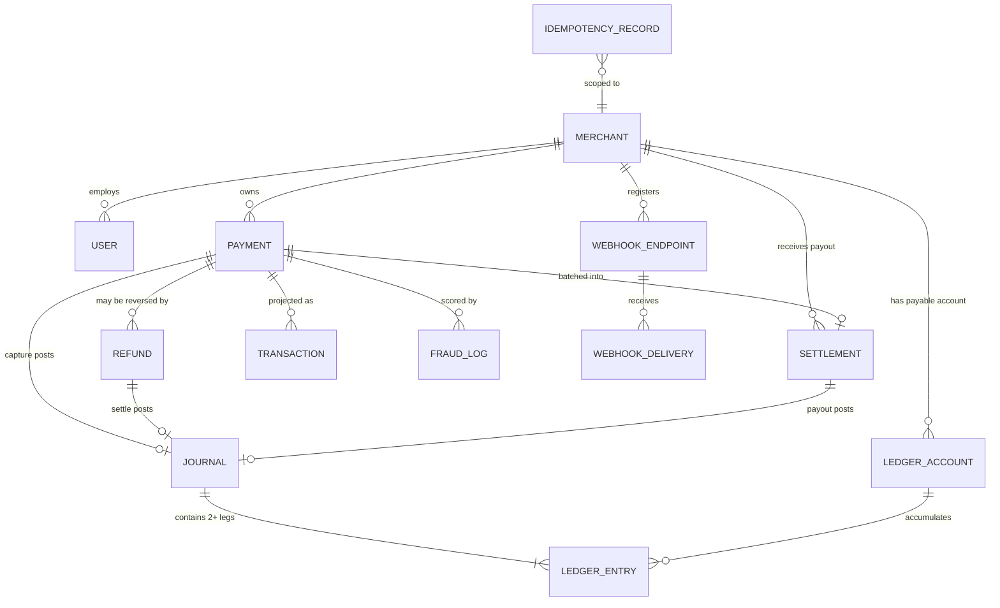

# Database Schema

MongoDB, 16 collections. Amounts are **always integers in the currency's minor unit** (paise/cents) — see `utils/money.js` for why floating point is never used for money.

## Entity relationships



---

## Core collections

### `payments`

The central document. Money fields are integers; `stateHistory` is append-only.

| Field | Type | Notes |
|---|---|---|
| `paymentId` | String, unique | `pay_` + 20 chars, non-sequential so volume cannot be inferred |
| `merchant` | ObjectId → Merchant | The tenant boundary |
| `amountMinor` | Int | Validated `Number.isInteger`, `min: 1` |
| `amountRefundedMinor` | Int | Drives `PARTIALLY_REFUNDED` vs `REFUNDED` |
| `feeMinor` | Int | Computed at creation and **frozen** — a later pricing change cannot retroactively alter a settled payment |
| `status` | Enum | Enforced by the state machine |
| `customer.last4` | String(4) | Only the network-safe fragment. Full PANs never enter this system. |
| `risk` | Subdoc | Score, decision, triggered rule ids |
| `stateHistory` | Array | Every transition with actor, reason, correlation id, timestamp |
| `idempotencyKey` | String, nullable | Recovery path if Redis is flushed |

**Indexes**

```js
{ merchant: 1, createdAt: -1 }                    // dominant dashboard query (ESR)
{ merchant: 1, status: 1, createdAt: -1 }         // filtered list view
{ status: 1, settledAt: 1, completedAt: 1 }       // settlement sweep
{ 'acquirer.referenceId': 1 }         { sparse }  // reconciliation; most rows are null
{ 'customer.email': 1, createdAt: -1 } { sparse }  // fraud velocity
{ 'context.ipAddress': 1, createdAt: -1 } { sparse }
{ merchant: 1, idempotencyKey: 1 }
    { unique, partialFilterExpression: { idempotencyKey: { $type: 'string' } } }
```

The partial filter matters: without it, every payment with a `null` key would collide on the unique index. With it, the index only contains rows that actually have a key — smaller and correct.

`optimisticConcurrency: true` makes Mongoose's `__v` a concurrency token, complementing the CAS status updates.

---

### The double-entry ledger — three collections


#### `journals` — the transactional envelope

Invariant: `totalDebitMinor === totalCreditMinor`. Asserted **before** any write, so an unbalanced journal never touches a balance. A rejected journal is stored as `REJECTED` rather than discarded, so an accounting bug leaves evidence.

```js
{ idempotencyKey: 1 } { unique }   // 'payment.capture:pay_abc' — the double-post guard
{ merchant: 1, postedAt: -1 }
{ 'reference.type': 1, 'reference.id': 1 }
```

#### `ledger_entries` — the atom

**Immutable by construction.** `pre('save')` rejects any non-new document; `pre` hooks on `updateOne`, `updateMany`, `findOneAndUpdate` and `replaceOne` reject query-level mutation, which bypasses document middleware. Corrections are made by posting a reversing journal, never by editing history.

- `balanceAfterMinor` — the account balance immediately after this leg. This is what turns the entry stream into a statement a merchant can read line by line.
- `sequence` — per-account monotonic position, with `{ account: 1, sequence: 1 } { unique }` so gap and duplicate detection are meaningful.

#### `ledger_accounts` — the cached position

`balanceMinor` is a **cache** of the entry stream, mutated only via atomic `$inc` alongside the entry that justifies it. `ReconciliationService` recomputes it from the entries and reports divergence rather than trusting the field.

Chart of accounts:

| Code | Type | Normal balance | Meaning |
|---|---|---|---|
| `gateway_clearing` | ASSET | Debit | Funds held at the acquirer |
| `merchant_payable:<id>` | LIABILITY | Credit | What we owe a specific merchant |
| `platform_revenue` | REVENUE | Credit | Our processing fee |
| `payment_reversals` | EXPENSE | Debit | Value returned to customers |

**Worked example — a ₹1,000.00 capture at 2%:**

```
DEBIT   gateway_clearing          100000    (asset ↑ — we hold the money)
CREDIT  merchant_payable:mrch_x    98000    (liability ↑ — we owe the merchant)
CREDIT  platform_revenue            2000    (revenue ↑ — our fee)
────────────────────────────────────────
        debits 100000 = credits 100000  ✓
```

Verified against a live database: trial balance equal, and `assets = liabilities + revenue − expenses` holds exactly.

---

### `idempotency_records`

The durable mirror of the Redis cache. Redis is the fast path; this is the record of truth.

```js
{ merchant: 1, endpoint: 1, key: 1 } { unique }   // the structural guarantee
{ expiresAt: 1 } { expireAfterSeconds: 0 }        // TTL matches the Redis TTL
```

Scoped per merchant **and** per endpoint: the same key on `POST /payments` and `POST /refunds` is two independent operations, and one merchant's key must never collide with another's.

---

### `webhook_deliveries` — the transactional outbox

```js
{ eventId: 1, endpoint: 1 } { unique }   // duplicate suppression
{ status: 1, nextAttemptAt: 1 }          // the retry sweeper's index-only range scan
{ merchant: 1, createdAt: -1 }
```

The unique index is the structural guarantee against a duplicate send: a producer retried by its own caller cannot create a second delivery. `attempts` is capped with `$slice: -20` so a pathological endpoint cannot bloat the document.

### `inbound_webhooks`

```js
{ provider: 1, providerEventId: 1 } { unique }   // upstream is at-least-once too
{ expiresAt: 1 } { expireAfterSeconds: 0 }       // 90-day TTL
```

Raw inbound payloads are operational data, not financial records — the resulting state change lives on the payment and in the ledger — so they expire.

---

### `audit_logs`

Append-only, enforced the same way as the ledger: `pre` hooks reject `updateOne`, `updateMany`, `findOneAndUpdate`, `deleteOne` and `deleteMany`. `timestamps: { createdAt: true, updatedAt: false }` — an audit record is never updated.

---

## Index design principles applied

1. **ESR ordering** — Equality fields first, then Sort, then Range. `{ merchant: 1, status: 1, createdAt: -1 }` serves "this merchant's failed payments, newest first" entirely from the index.
2. **Partial indexes for sparse uniqueness** — `idempotencyKey` is null on most payments; a plain unique index would reject the second null.
3. **TTL indexes for operational data** — inbound webhooks and idempotency records expire; financial records never do.
4. **Anchored regex only** — `TransactionRepository.search` uses `^term`, never `.*term.*`, because an unanchored regex cannot use an index and degrades to a collection scan.
5. **Bounded arrays** — `attempts` capped at 20, `stateHistory` naturally bounded by the state machine.
