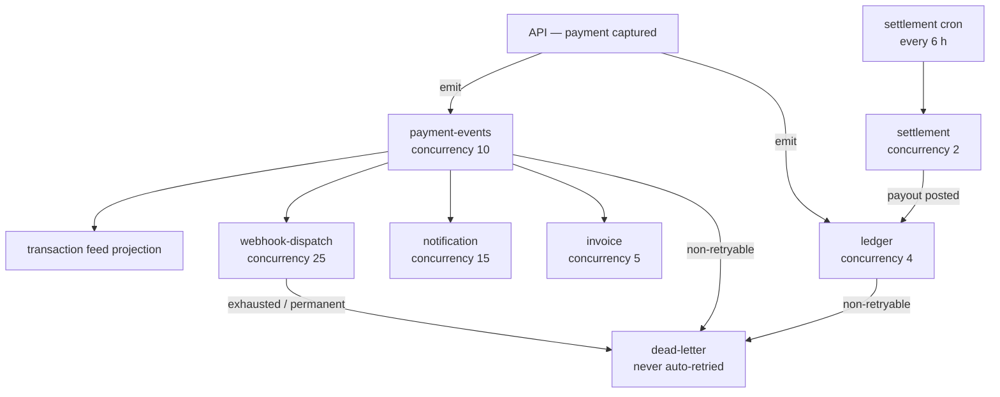

# Queue Architecture

BullMQ over Redis. Seven queues, each with a retry policy matched to how costly a lost job is.



## Queue policies

| Queue | Attempts | Backoff | Failed jobs | Concurrency | Rationale |
|---|---|---|---|---|---|
| `payment-events` | 5 | exp, 2s | kept 7 d | 10 | Fan-out hub |
| `ledger` | **10** | exp, 3s | **never removed** | **4** | Money. A ledger job that never lands is a book that does not balance. Low concurrency because account documents are the write-contention point — more parallelism buys conflicts, not throughput. |
| `settlement` | 5 | exp, 30s | never removed | 2 | Payouts. Serialised per merchant by a lock anyway. |
| `webhook-dispatch` | **1** | — | kept 3 d | **25** | BullMQ retry is *disabled*; retries follow our own published ladder. High concurrency because dispatch is almost entirely waiting on someone else's HTTP server. |
| `notification` | 3 | exp, 5s | kept 1 d | 15 | A lost receipt email is an inconvenience, not a financial defect. |
| `invoice` | 3 | exp, 10s | kept 3 d | 5 | |
| `dead-letter` | 1 | — | never removed | — | Terminal by definition. |

`webhook-dispatch` deliberately has `attempts: 1`. Two competing retry mechanisms would double-send, and merchants could not reason about when the next attempt is due.

---

## Delivery semantics: at-least-once, made safe

BullMQ is at-least-once. A worker can be killed after doing its work but before acking, so the job runs again. **"Exactly once" is not something a queue can give you; idempotent consumers are.**

Every consumer is idempotent by construction:

| Consumer | Idempotency mechanism |
|---|---|
| `ledger` | Deterministic journal key `payment.capture:<paymentId>` behind a unique index. A redelivered job returns the original journal. |
| `webhook-dispatch` | Unique `(eventId, endpoint)` index. A duplicate insert is a no-op, not an error. |
| `payment-events` | Projections check for an existing row before inserting. |
| `settlement` | Deterministic `batchKey` per `(merchant, currency, window)` behind a unique index. |

Producers additionally pass a deterministic `jobId`, so BullMQ itself refuses to enqueue the same logical work twice.

> **Implementation note.** BullMQ reserves `:` as its key separator and *rejects* custom job ids containing one — and `queue.add()` rejects asynchronously, so a colon in a job id makes the producer fail **silently** and the job is never enqueued. An early version of this system used `ledger:capture:<id>` as a job id and the entire async pipeline was dead: zero jobs processed, every failure swallowed by a `.catch()` on a fire-and-forget publish. Job ids are now built by a helper that joins with `-` and strips colons defensively.

---

## Worker instrumentation

Every processor is wrapped so that:

1. **The producer's correlation id is restored** into `AsyncLocalStorage`. This is what lets a log search follow one payment from the HTTP request through five workers — a webhook retry six hours later logs the same id as the original request.
2. **Duration and outcome are recorded** as Prometheus metrics, labelled by queue and job name (bounded cardinality).
3. **Non-retryable errors skip the retry budget.** An `AppError` with `retryable: false` will fail identically on every attempt; burning nine more retries just delays the dead-letter and hides the real problem, so it goes straight to the DLQ.

## The dead-letter queue is an inbox, not a graveyard

A dead-lettered job preserves its original payload, its originating queue, the error, and the attempt count. An operator fixes the cause and replays it — rather than reconstructing the job by hand from log lines.

Webhook replays create a **new** delivery row with a fresh event id (the unique index would otherwise reject the replay as a duplicate) and a `replayedFromDeliveryId` link back, because the failed attempt history is evidence and must survive.

## Scaling

```bash
docker compose up -d --scale worker=4
```

Workers are stateless and competing consumers; BullMQ distributes jobs across them. Because the API and worker are separate containers, queue backlog and request load scale independently.

`stalledInterval: 30_000` — a job whose worker died is re-queued after 30 seconds. Too short and a slow-but-healthy job gets duplicated; 30s comfortably exceeds our longest normal processing time.

## Graceful shutdown

`worker.close()` waits for in-flight jobs to finish before returning, which is what makes a rolling deploy safe: a half-processed ledger posting completes and acks rather than being abandoned mid-write. `stop_grace_period: 30s` in compose gives it room; `dumb-init` as PID 1 ensures SIGTERM actually reaches Node in the first place.
