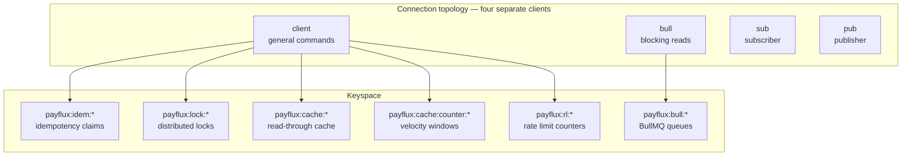

# Redis Architecture

Redis serves five distinct roles. Each has its own keyspace, TTL policy and failure behaviour.



## Why four connections

A blocking command monopolises its socket. BullMQ issues `BZPOPMIN` / `BRPOPLPUSH`, which park indefinitely — if that shared a connection with the cache, every `GET` would queue behind a blocked read. Likewise, once a connection subscribes it may only issue subscribe-family commands.

`maxRetriesPerRequest: null` is **mandatory** on the BullMQ connection: BullMQ manages its own retry semantics, and ioredis's default would abort a blocking read mid-flight.

Connections use `lazyConnect: true` so importing a module never opens a socket — `require()` must be free of I/O side effects, otherwise a unit test that merely imports a service inherits a live connection and the process never exits.

---

## 1. Idempotency claims

```
Key    payflux:idem:{merchantId}:{METHOD path}:{key}
Value  {"state":"IN_FLIGHT|COMPLETED","requestFingerprint":"sha256…",
        "responseStatus":201,"responseBody":{…}}
TTL    86400s (24 h)
Op     SET key value EX 86400 NX     ← atomic claim
```

`SET NX` is the whole mechanism: exactly one concurrent request can create the key, even across replicas. The TTL means a crashed request cannot wedge a key permanently.

**Redis is the fast path, not the guarantee.** A `FLUSHALL` or an eviction would otherwise turn a client's safe retry into a second charge, so every claim is mirrored to a MongoDB unique index. Redis absorbs the reads; Mongo provides correctness.

## 2. Distributed locks

```
Key    payflux:lock:payment:{paymentId}
       payflux:lock:settlement:{merchantId}:{currency}
       payflux:lock:scheduler:{jobName}
Value  a 16-byte cryptographically random token
TTL    10s default, renewable
```

Acquire is `SET key token PX ttl NX`. Release and extend are **Lua scripts**, because both must be compare-and-swap:

```lua
-- release: delete only if we still hold it
if redis.call("GET", KEYS[1]) == ARGV[1] then
  return redis.call("DEL", KEYS[1])
else
  return 0
end
```

Without that comparison, a holder whose lock had already expired could delete a *different* caller's lock and silently break mutual exclusion. This is the single most common bug in hand-rolled Redis locks, and there is a dedicated integration test for it.

**Honest limitation:** a Redis lock is an optimisation, not an absolute mutex. Under a primary failover with unreplicated writes, or a GC pause exceeding the TTL, two holders are possible. Every critical section it guards is therefore *also* protected by a database invariant (CAS status filters, unique journal keys), so a lost lock degrades to a rejected write rather than a double charge.

## 3. Read-through cache

```
Key    payflux:cache:{namespace}:{id}
TTL    30s   analytics overview
       600s  merchant fraud baseline
```

`CacheService.wrap` implements **single-flight**: on a miss, one caller wins a short `SET NX` lock and runs the loader while the others poll briefly for the populated value. Without it, a hot key expiring under load turns into a cache stampede that saturates Mongo.

Invalidation uses `SCAN`, **never** `KEYS`. `KEYS pattern` is O(N) over the entire keyspace and blocks the single-threaded server for its duration — on a large instance that is a multi-second stall for every other client.

Every cache method degrades gracefully: if Redis is down, `get` returns null and `wrap` falls through to the loader. A cache outage must slow the system down, never take it down.

## 4. Velocity counters (fraud)

```
Key    payflux:cache:counter:velocity:cust:{merchantId}:{email}
       payflux:cache:counter:velocity:ip:{merchantId}:{ip}
TTL    300s sliding window
Op     MULTI → INCR key → EXPIRE key 300 NX → EXEC
```

`EXPIRE … NX` sets the TTL only on the first increment, which is what makes it a *fixed window* rather than one that resets on every hit. `INCR` is O(1) — counting payments in Mongo on every checkout would put a range scan on the critical path of a payment.

## 5. Rate limiting

```
Key    payflux:rl:{scope}:{principal}
Scopes global (300/min) · pay (60/min) · auth (10/15min)
```

The counter lives in Redis, not process memory. With N API replicas an in-memory limiter would let a client through **N × limit** times — the limit would silently scale with the deployment, which is the opposite of what a limit is for.

Keyed by the authenticated principal where one exists, falling back to IP. Keying purely by IP would punish every customer behind a shared corporate NAT for one noisy neighbour.

Rate limiting **fails open** when Redis is unavailable: a cache outage must not lock out every merchant.

## 6. BullMQ

```
Prefix payflux:bull:{queueName}:*
```

Managed entirely by BullMQ — see [queue-architecture.md](./queue-architecture.md).

---

## Eviction policy — `noeviction`, deliberately

```yaml
--maxmemory 512mb --maxmemory-policy noeviction
```

Redis holds idempotency claims and distributed locks. Silently evicting one under memory pressure would let a duplicate charge through. Failing writes loudly is strictly better than losing a correctness guarantee quietly.

Persistence is `appendonly yes` with `appendfsync everysec` — a one-second worst-case loss window on a restart, backed by the Mongo mirror for anything that matters.

## Failure behaviour summary

| Component | Redis unavailable |
|---|---|
| Idempotency | Falls back to the Mongo unique index. Correct, just slower. |
| Locks | `LockAcquisitionError` (423, retryable). Database CAS still prevents corruption. |
| Cache | Returns null, falls through to the source. |
| Rate limiting | Fails **open**. |
| Queues | Producers throw; the payment still succeeds (jobs are fire-and-forget) and the retry scheduler re-drives the missing work. |
