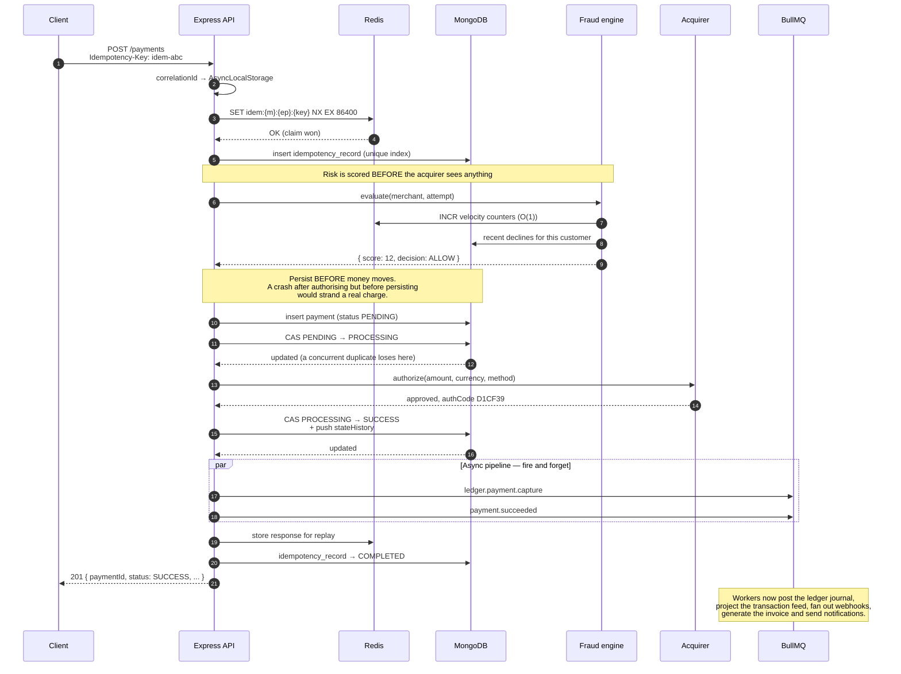
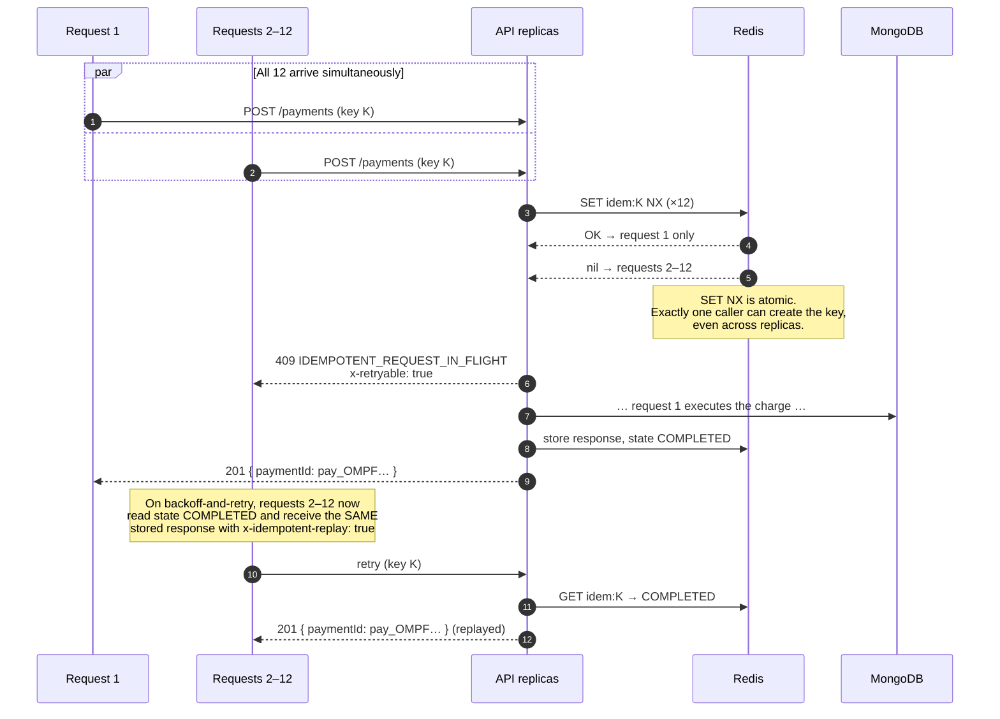
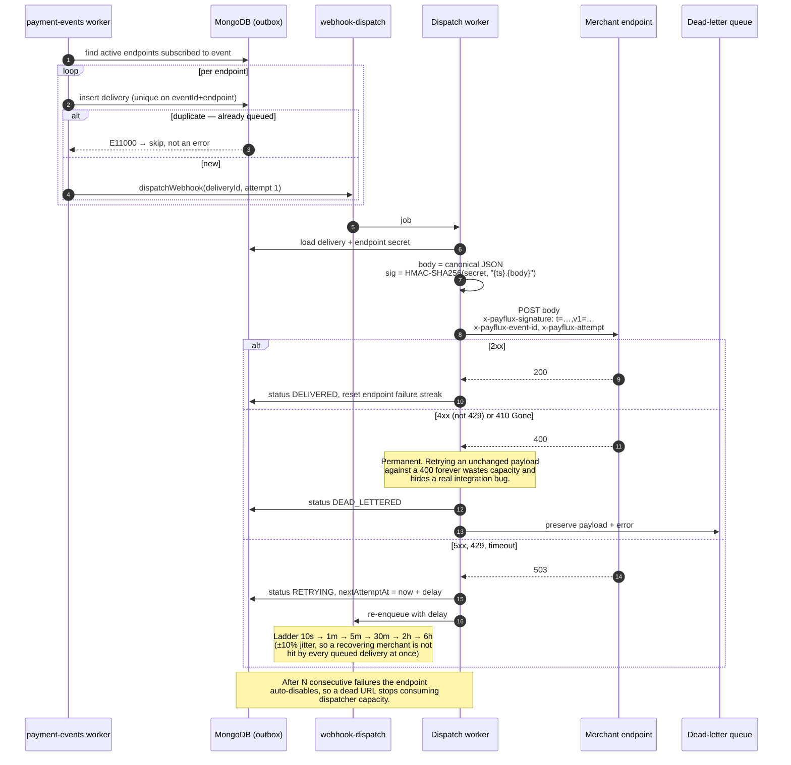

# Sequence Diagrams

## 1. Create payment — the happy path



**Why persist before authorising:** if the process dies between step 12 and 14, the worst case is a payment stuck in `PROCESSING` that the reconciliation sweeper resolves. If we authorised first, the worst case would be a real charge with no record of it — unrecoverable.

---

## 2. Idempotent retry — 12 concurrent requests, one key



**Measured:** 12 concurrent requests → 1 × `201`, 11 × `409`, exactly **one** row in the database.

If the retry carries a *different* body, the stored `requestFingerprint` (SHA-256 over a key-sorted canonical form) will not match and the API returns `422 IDEMPOTENCY_KEY_REUSE` — replaying a stored response for a different request would confirm a payment the caller never made.

---

## 3. Refund — three layers against over-refunding

```mermaid
sequenceDiagram
    autonumber
    participant C as Client
    participant API as API
    participant L as Redis lock
    participant M as MongoDB
    participant A as Acquirer

    C->>API: POST /payments/{id}/refunds { amountMinor: 70000 }

    rect rgb(28,34,46)
        Note over API,L: Layer 1 — serialise refunds for this payment
        API->>L: SET lock:payment:{id} token PX 10000 NX
        L-->>API: acquired
    end

    API->>M: load payment (status, amountMinor)

    rect rgb(28,34,46)
        Note over API,M: Layer 2 — committed refunds reserve their amount.<br/>PENDING and PROCESSING refunds count, because<br/>an in-flight refund has already claimed the funds.
        API->>M: SUM(amountMinor) WHERE status ≠ FAILED
        M-->>API: committed = 40000 → available = 60000
    end

    alt requested > available
        API-->>C: 422 REFUND_EXCEEDS_BALANCE<br/>{ requested: 70000, available: 60000 }
    else within balance
        API->>M: insert refund (PENDING)
        API->>A: refund(amount)
        A-->>API: accepted

        rect rgb(28,34,46)
            Note over API,M: Layer 3 — the database itself refuses to over-refund
            API->>M: updateOne({ paymentId,<br/>  status ∈ {SUCCESS, PARTIALLY_REFUNDED},<br/>  $expr: amountRefunded + amt ≤ amountMinor })
            alt matched
                M-->>API: PARTIALLY_REFUNDED / REFUNDED
                API->>M: refund → SUCCESS
            else no match — would breach the cap
                M-->>API: null
                API->>M: refund → FAILED (REFUND_LIMIT_BREACHED)
            end
        end
    end

    API->>L: releaseLock (Lua compare-and-delete)
```



Layer 3 is the guarantee. Layers 1 and 2 exist so the common case returns a clean, informative error instead of a lost race.

**Measured:** six concurrent ₹300 refunds against a ₹1,000 payment → at most three succeed; `amountRefundedMinor ≤ amountMinor` always holds.

---

## 4. Webhook delivery with retries and dead-lettering



The delivery row is written **before** any HTTP is attempted (transactional outbox). If the process dies mid-dispatch, the row is still there and the retry sweeper finds it — an event held only in memory would vanish with the pod.

---

## 5. Settlement — build and payout

```mermaid
sequenceDiagram
    autonumber
    participant S as Scheduler (every 6h)
    participant L as Redis lock
    participant Q as settlement queue
    participant W as Settlement worker
    participant M as MongoDB
    participant A as Bank rail
    participant LG as ledger queue

    Note over S,L: Every API replica ticks; one wins the lock.<br/>Poor-man's leader election.
    S->>L: SET lock:scheduler:settlement-sweep NX
    L-->>S: acquired (other replicas skip)

    S->>M: merchants with autoSettle
    loop per merchant
        S->>Q: settlement.build(merchantId, currency)
    end

    Q->>W: build job
    W->>L: lock settlement:{merchant}:{currency}
    W->>M: batchKey = {merchant}:{currency}:{hour}
    alt batch already exists
        M-->>W: return it — never pay a window twice
    else new window
        W->>M: payments WHERE status=SUCCESS<br/>AND settlement=null<br/>AND completedAt ≤ now − holdHours
        W->>W: net = gross − refunds − fees
        W->>M: insert settlement (QUEUED)
        W->>M: claim payments<br/>(filter settlement:null — un-stealable)
        W->>Q: settlement.execute
    end

    Q->>W: execute job
    W->>M: CAS QUEUED → PROCESSING
    W->>A: payout(net)
    alt success
        A-->>W: reference
        W->>M: CAS PROCESSING → SETTLED
        W->>LG: ledger.settlement.payout
        Note over LG: DEBIT merchant_payable (liability discharged)<br/>CREDIT gateway_clearing (funds leave)
    else failure
        W->>M: CAS PROCESSING → FAILED, increment attempts
        Note over W: Payments stay claimed by this batch,<br/>so another batch can never double-pay them.
    end
```

---

## 6. Acquirer unreachable — the reconciliation path

```mermaid
sequenceDiagram
    autonumber
    participant C as Client
    participant API as API
    participant CB as Circuit breaker
    participant A as Acquirer
    participant M as MongoDB
    participant S as Reconcile scheduler

    C->>API: POST /payments
    API->>M: payment → PROCESSING
    API->>CB: authorize()
    CB->>A: HTTP
    A--xCB: timeout

    Note over API,M: The payment is NOT marked failed.<br/>The authorisation may have succeeded upstream;<br/>declaring it failed would strand a real charge.
    API->>M: leave status PROCESSING
    API-->>C: 201 { status: PROCESSING }

    loop 5 consecutive transport failures
        CB->>CB: failures++
    end
    CB->>CB: OPEN — fail fast for 30s
    Note over CB: Protects our own connection pool<br/>and gives the acquirer room to recover.

    S->>M: payments PROCESSING older than 2 min
    S->>API: reconcileWithAcquirer (under a lock)
    API->>CB: authorize() — half-open probe
    alt acquirer recovered, approved
        A-->>API: approved
        API->>M: CAS PROCESSING → SUCCESS
        API->>API: emit the async pipeline
    else declined
        API->>M: CAS PROCESSING → FAILED
    else still unreachable
        Note over API: Leave PROCESSING. Never guess<br/>at an outcome we cannot observe.
    end
```
