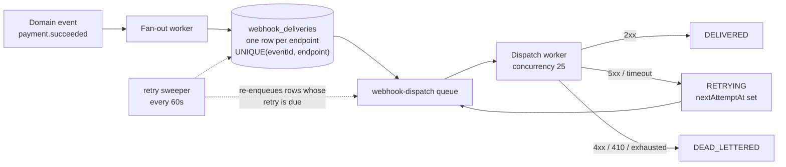
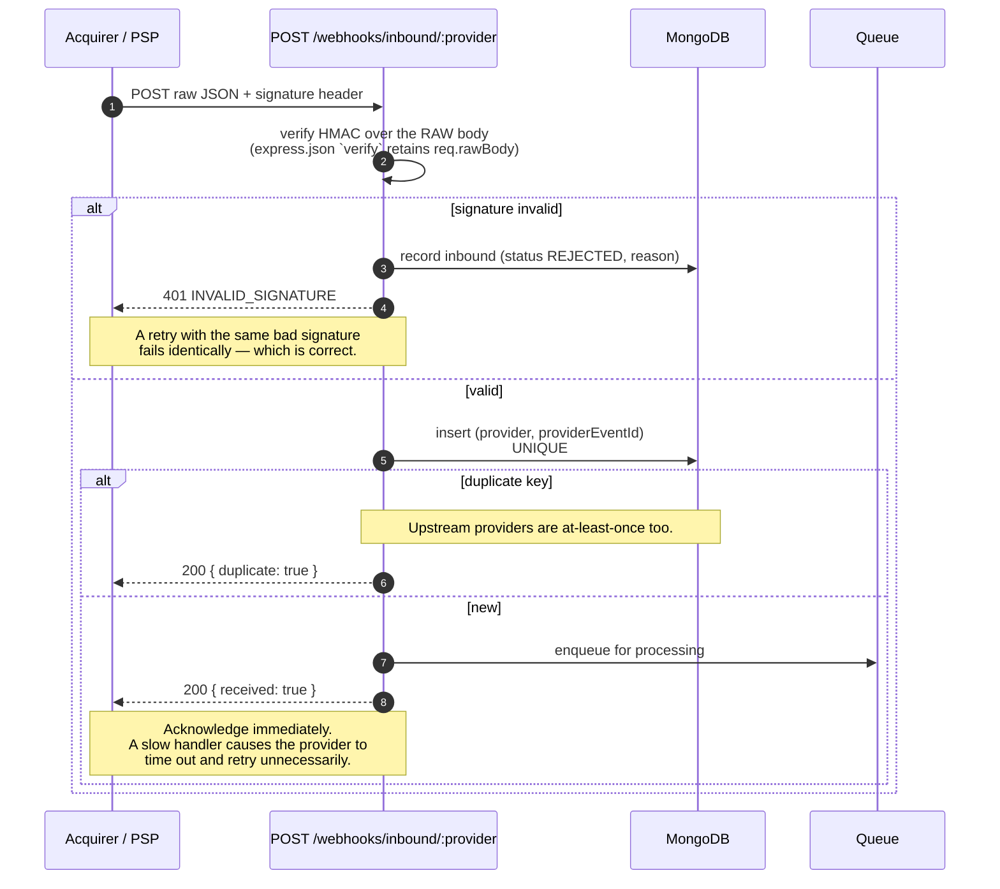

# Webhook Flow

Two directions, opposite trust models.

- **Outbound** — we notify merchants. We are the sender, so we sign and we retry.
- **Inbound** — acquirers notify us. We are the receiver, so we verify and we deduplicate.

---

## Outbound: the transactional outbox



The delivery row is committed **before** any HTTP is attempted. If the process dies mid-dispatch, the row survives and the sweeper picks it up — an event held only in memory would vanish with the pod. That is the transactional-outbox pattern, and it is what turns "we tried to send it" into "we will send it".

### Duplicate suppression

`UNIQUE (eventId, endpoint)`. A producer retried by its own caller cannot create a second delivery — the insert is rejected and treated as a **no-op, not an error**. Under at-least-once queue delivery this is a normal outcome, not an exception.

### Retry ladder

Published, deterministic, and documented so integrators can reason about worst-case delivery latency instead of guessing:

```
attempt 1 → immediate
attempt 2 → +10s
attempt 3 → +1m
attempt 4 → +5m
attempt 5 → +30m
attempt 6 → +2h
attempt 7 → +6h   → then dead-letter
```

Each delay carries **±10% jitter**. Without it, a merchant recovering from an outage is hit by every queued delivery at exactly the same instant — the thundering herd that knocks the recovering service straight back over.

### Retry decisions follow HTTP semantics

| Response | Action | Why |
|---|---|---|
| `2xx` | Delivered; endpoint failure streak reset | |
| `5xx`, timeout, connection error | Retry per the ladder | Transient — the endpoint may recover |
| `429` | Retry per the ladder | The receiver is asking us to slow down |
| `4xx` (other) | **Dead-letter immediately** | The payload is malformed *for this receiver*. Retrying an unchanged body against a 400 forever wastes capacity and hides a real integration bug from the merchant. |
| `410 Gone` | **Dead-letter immediately** | The endpoint is explicitly telling us to stop |

### Endpoint health

After `maxAttempts` **consecutive** failures the endpoint auto-disables, so a permanently dead URL stops consuming dispatcher throughput. Re-enabling it from the console clears the streak — otherwise it would be auto-disabled again on the first hiccup.

### Signing

```
body = canonical JSON (keys sorted — signing and verifying always agree)
sig  = HMAC-SHA256(secret, "{timestamp}.{body}")
header: x-payflux-signature: t=1788172495,v1=a3f5…
```

The **timestamp is inside the signed material**. That is what makes replay protection meaningful: an attacker cannot lift a valid signature and pair it with a fresh timestamp. A dedicated unit test signs at `now − 60s`, re-presents the signature with a fresh timestamp, and asserts it is rejected.

Every request also carries `x-payflux-event-id`, `x-payflux-event-type`, `x-payflux-delivery-id` and `x-payflux-attempt`.

### Verifying, as a merchant

```js
const crypto = require('crypto');

app.post('/hooks/payflux',
  express.raw({ type: 'application/json' }),   // the RAW body — see below
  (req, res) => {
    const [t, v1] = req.get('x-payflux-signature').split(',')
      .map(part => part.split('=')[1]);

    // Reject stale timestamps first — this is your replay window.
    if (Math.abs(Date.now() / 1000 - Number(t)) > 300) return res.sendStatus(401);

    const expected = crypto.createHmac('sha256', process.env.PAYFLUX_WEBHOOK_SECRET)
      .update(`${t}.${req.body}`)
      .digest('hex');

    // Constant-time comparison — a plain === leaks timing information.
    const a = Buffer.from(expected), b = Buffer.from(v1);
    if (a.length !== b.length || !crypto.timingSafeEqual(a, b)) return res.sendStatus(401);

    const event = JSON.parse(req.body);

    // We guarantee at-least-once. You make it effectively-once.
    if (alreadyProcessed(event.id)) return res.sendStatus(200);

    // Acknowledge fast, process asynchronously — a slow 200 causes a retry
    // you did not need.
    res.sendStatus(200);
    queue.add('payflux-event', event);
  });
```

> **The raw body matters.** Verify against the exact bytes received. Parsing to an object and re-serialising produces different bytes and the HMAC will not match. This is the single most common webhook integration failure.

### Secret rotation

`POST /webhooks/endpoints/:id/rotate-secret` issues a new secret and retains the previous one for a grace window, so a merchant can deploy the new secret without dropping events mid-rollout.

### Replay from the dead-letter queue

A replay creates a **new** delivery row with a fresh event id (the unique index would otherwise reject it as a duplicate) and a `replayedFromDeliveryId` link back to the original. The failed attempt history is evidence and must survive — the DLQ is an inbox, not a graveyard.

---

## Inbound: verify, deduplicate, acknowledge fast



Raw inbound payloads carry a **90-day TTL**: they are operational data for dispute investigation, not financial records. The resulting state change lives on the payment and in the ledger, which never expire.
