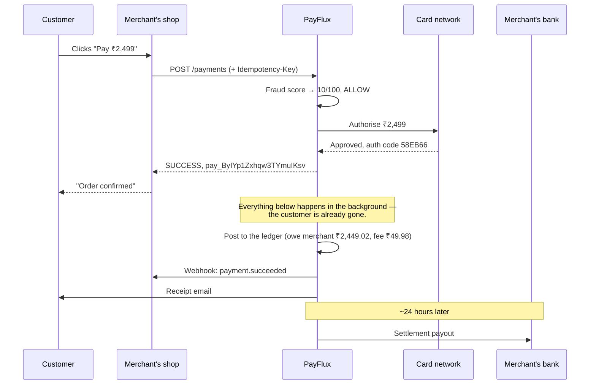

# What PayFlux Is — and Who Would Use It

Plain-English explanation. No prior payments knowledge assumed.

---

## 1. First, what is a payment gateway?

When you buy something online, your money makes a longer journey than it appears:

```
You (card)  →  the shop  →  a payment gateway  →  the card network  →  your bank
                                    ↓
                            the shop's bank account (days later)
```

The shop does **not** talk to Visa or to your bank directly. Doing so requires banking licences,
certified hardware, and PCI-DSS compliance. Instead the shop uses a **payment gateway** — the
software layer that sits between "customer clicked Pay" and "money arrived in the merchant's bank
account".

Stripe, Razorpay, Adyen and PayPal are payment gateways. **PayFlux is a working implementation of
that layer.**

---

## 2. What the gateway is actually responsible for

This is the part people underestimate. Taking the money is the easy bit. The gateway owns everything
that can go wrong afterwards:

| Job | What happens without it |
|---|---|
| **Don't charge twice** | The customer's network drops during checkout, their app retries, and they are charged ₹2,499 twice. |
| **Don't refund more than was paid** | Two support agents refund the same order at the same moment and the shop pays out ₹5,000 on a ₹2,499 order. |
| **Keep books that balance** | Nobody can answer "how much do we owe this merchant?" and the finance team cannot close the month. |
| **Catch fraud before the money moves** | A stolen card gets tested 200 times against your shop, and you eat every chargeback. |
| **Tell the merchant what happened** | The shop never learns the payment succeeded, so the order is never shipped. |
| **Pay the merchant** | Money sits in the gateway's account forever. |
| **Survive the card network being down** | Every checkout fails, or worse, you take money and lose the record of it. |

PayFlux implements all seven.

---

## 3. What PayFlux does, feature by feature

### Takes payments
A merchant's server calls one API. PayFlux scores the transaction for fraud, sends it to the card
network, and returns a definitive answer — succeeded, failed with a reason, or still processing.

### Never double-charges
Every payment request carries an **idempotency key** — a unique id the merchant generates per order.
Retry with the same key and you get the *original* answer back, not a second charge. Tested at 12
simultaneous identical requests producing exactly **one** charge.

### Refunds, in full or in part
Refund a whole order, or ₹500 of a ₹2,499 order because one item came back. PayFlux tracks how much
remains refundable and refuses — at three independent layers — to let the total exceed what was
actually paid.

### Keeps double-entry books
Every rupee that moves is recorded twice, in a system accountants have used since the 1400s. This is
what lets the platform *prove* its numbers rather than merely assert them:

```
A ₹1,000 sale at a 2% fee:
  money arrives in our holding account        +₹1,000
  we now owe the merchant                       ₹980
  we earned a fee                                ₹20
                                             ─────────
  what came in (₹1,000) = what it became (₹980 + ₹20)   ✓
```

A reconciliation job re-checks the entire ledger on a schedule and reports any discrepancy. It
deliberately never "fixes" one silently.

### Scores every transaction for fraud
Twelve weighted rules — unusually large amounts, too many attempts from one card or IP, the IP
country not matching the billing country, sanctioned jurisdictions, disposable email domains, the
small-amount-high-frequency pattern that means someone is testing stolen cards. Each transaction gets
a 0–100 risk score. Above 80 it is blocked before the card network is ever contacted; 50–80 is
flagged for a human.

### Notifies merchants (webhooks)
When something happens to a payment, PayFlux POSTs a signed message to the merchant's server. If the
merchant's server is down it retries on a published schedule — 10s, 1m, 5m, 30m, 2h, 6h — then parks
the message in a dead-letter queue an operator can replay once the problem is fixed.

### Pays merchants out
Captured money is held briefly (a fraud/chargeback window), then batched into a **settlement** —
gross sales, minus refunds, minus fees — and paid to the merchant's bank account.

### Shows operators what's happening
A web dashboard with live revenue, success rate, failed payments, refunds, fraud alerts, the
settlement queue, and a searchable transaction list.

---

## 4. Who uses it, and how

Three different people, three different entry points.

### The merchant's *developer* — uses the API

Integrates PayFlux into their shop's backend. Never opens the dashboard.

```bash
POST /api/v1/payments
Authorization: Bearer <token>
Idempotency-Key: order-88421-attempt-1

{ "amountMinor": 249900, "currency": "INR", "method": "CARD", ... }
```

→ [`integration-guide.md`](./integration-guide.md) is written for this person.

### The merchant's *operations team* — uses the dashboard

Looks up a customer's payment, issues a refund, checks whether today's settlement went out, sees why
a webhook is failing. Signs in as a `MERCHANT` user and sees **only their own** merchant's data.

### The *platform's* staff — also the dashboard, with more visibility

- `ADMIN` — sees every merchant, can trigger settlements and run ledger reconciliation.
- `SUPPORT` — sees everything but **cannot change anything**. Read-only, enforced by the server.

→ [`console-guide.md`](./console-guide.md) is written for these two.

---

## 5. A payment, end to end



The customer waits only for the first five steps. Ledger posting, webhooks, receipts and settlement
all happen after the response is sent — which is why checkout stays fast and why an email provider
being down cannot fail a payment.

---

## 6. Can I use this to take real money today?

**No — and that is a deliberate, disclosed boundary.**

Everything is real and working *except the final leg to the actual card networks*. The component
that talks to Visa/Mastercard is a **simulator**: it approves most transactions, declines about 8%
with realistic reason codes (insufficient funds, expired card, do-not-honor), and fails about 8% of
the time with a network error so the retry and circuit-breaker paths get exercised.

Everything around it is genuinely production-shaped: the idempotency guarantees, the ledger, the
locking, the queues, the fraud rules, the webhook signing, the security model.

### What it would take to process real payments

| Requirement | Status |
|---|---|
| Swap the simulator for a real PSP client (Stripe, Razorpay, Adyen) | One file — `src/services/acquirer.service.js`. The boundary is already correct: timeouts, circuit breaker, declines distinguished from retryable failures. |
| PCI-DSS compliance | Not done. PayFlux never touches full card numbers (only the last 4 digits), which keeps it in the *lowest* compliance tier — but you would still need a certified card-collection method such as a hosted field or PSP-issued token. |
| A payment-institution licence, or a sponsor bank | Legal and regulatory. Nothing to do with code. |
| KYC / AML on merchants | Not built. |
| Production hardening | Real TLS certificates, secrets in a vault rather than `.env`, tokens in httpOnly cookies rather than `localStorage`, a monitoring backend. |

### So what *is* it good for?

1. **A portfolio and interview piece.** It demonstrates the distributed-systems problems that make
   payments hard — and, more usefully, it can prove its claims with measurements rather than
   assertions.
2. **A learning reference** for idempotency, double-entry accounting, distributed locking,
   at-least-once queue semantics, and circuit breakers, all in one coherent codebase.
3. **A foundation.** With a real PSP client dropped in, the surrounding architecture is genuinely
   the shape a production gateway needs.
4. **An internal ledger for a business that already has a PSP.** Plenty of companies use Stripe for
   card processing but still need their own reconciliation, settlement and merchant-payable
   accounting on top. That is exactly what this is.

---

## 7. Try it in three minutes

```bash
cd payflux
docker compose up -d --build
docker compose exec api npm run seed
```

Open the console at **http://localhost:8080** and sign in as `admin@payflux.io` / `PayFlux#2024`. You will see 420 seeded payments, real charts, a balanced
ledger, and fraud alerts.

Then take a payment yourself:

```bash
TOKEN=$(curl -s -X POST localhost:4000/api/v1/auth/login \
  -H 'content-type: application/json' \
  -d '{"email":"merchant@nimbusretail.example","password":"PayFlux#2024"}' \
  | jq -r .data.accessToken)

curl -X POST localhost:4000/api/v1/payments \
  -H "authorization: Bearer $TOKEN" \
  -H 'content-type: application/json' \
  -H 'idempotency-key: my-first-order' \
  -d '{"amountMinor":249900,"currency":"INR","method":"CARD",
       "customer":{"email":"buyer@example.com","country":"IN"}}'
```

Run that second command **twice**. You get the same `paymentId` both times, and the second response
carries `x-idempotent-replay: true`. That is the core guarantee, visible in ten seconds.
